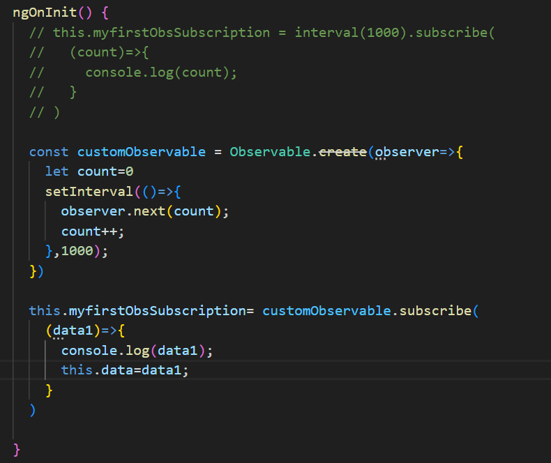

# ObservablesStart

This project was generated with [Angular CLI](https://github.com/angular/angular-cli) version 16.1.7.

## Development server

Run `ng serve` for a dev server. Navigate to `http://localhost:4200/`. The application will automatically reload if you change any of the source files.

## Code scaffolding

Run `ng generate component component-name` to generate a new component. You can also use `ng generate directive|pipe|service|class|guard|interface|enum|module`.

## Build

Run `ng build` to build the project. The build artifacts will be stored in the `dist/` directory.

## Running unit tests

Run `ng test` to execute the unit tests via [Karma](https://karma-runner.github.io).

## Running end-to-end tests

Run `ng e2e` to execute the end-to-end tests via a platform of your choice. To use this command, you need to first add a package that implements end-to-end testing capabilities.

## Further help

To get more help on the Angular CLI use `ng help` or go check out the [Angular CLI Overview and Command Reference](https://angular.io/cli) page.

## 01. Observables Intro

- You use it to handle asynchronous tasks, because all these data sources here, user events, triggered in your code or a HTTP request, are asynchronous tasks. You don't know when they will happen and you don't know how long they will take. So if you execute your normal application code, you don't want to wait for these events or you don't want to wait for the completion of such a HTTP request because that would block your program, would block your logic.

- Therefore, we'd need methods of handling such asynchronous tasks. And historically you might have used callbacks or promises and it's not necessarily bad to use them. Observables is just a different approach of handling that, a different alternative. And Angular embraces observables.

## 02. interval() which takes time in milliseconds.And for every specified time interval, it emits new value. So it is an observable to which we can subscribe.

- Now when I navigate away now to user one you see that this keeps on counting and that is something you have to be aware of. Observables don't necessarily stop emitting values just because you're not interested in them anymore. There are certain observables that emit a value once and they're done. Like for example an HTTP request where you get back a response something you'll see later in the HTP module of this course.

- But there are other observables that keep on emitting values and to stop that and their effort to prevent memory leaks which you would otherwise introduce If that keeps on emitting whilst you're not interested in it anymore you should unsubscribe from any observable in which values you are no longer interested.

* While unsubscribing to the subscription, we are storing subscription from the subscribe function and not from observable.

* For the observables provided by Angular like params but also any other observable you'll encounter throughout this course that is provided by a Angular package or by a feature provided by Angular. All these Angular observables are managed by Angular and therefore you don't need to unsubscribe manually here.

## 03 - Building a new Custom Observable using Observable.create(Observer=>{})

- The observer in the end is the part that is interested in being informed about new data, about errors, or about the observable being completed.

* Now our job here is to tell the observer about new data, about an error, or about the observable being completed. Here, we're not responsible for listening because the observer is the listener. Here, we get that listening part as an argument and we need to tell it once we're done, once new data is there, and so on. So in this anonymous function

## 04 - Implemented error() and complete() methods on Custom Observable.

- whenever an observable throws an error, it cancels, it's done. It will not emit any error values, it dies so to say. And therefore in that case you also don't need to unsubscribe. You still can unsubscribe. If you never get away, you'll not get an error. But it's not necessary because, well, it was dead anyways but you might not have known that when you unsubscribe. So unsubscribing is not an issue.

- Now we get our alert and you see we don't have that red error here on the right anymore. Instead it's now a regular console log because that's what we're doing. So now we're handling that error and that of course is also an important part. Now handling errors is nice

* Completing can be a normal process in an observable. Now our interval by default doesn't complete. It will emit new values until the end of time. And HTTP request on the other hand, will complete. It completes whenever a response by the server is there. And of course here when we're building our own observable from the crowned up, we can also complete this manually.

* When it cancels due to an error then that's a different thing than when it completes. An error cancels the observable. It does not complete it.
