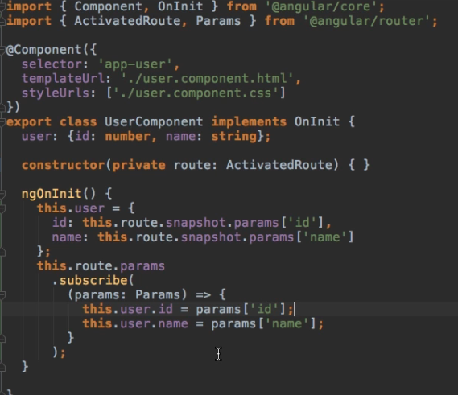
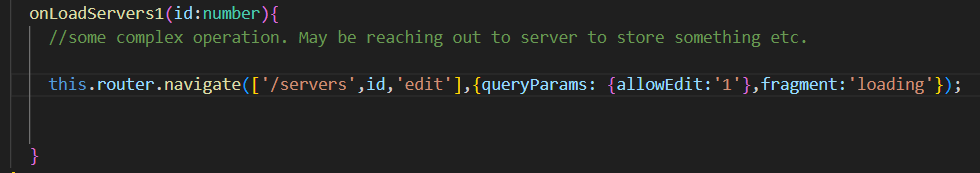
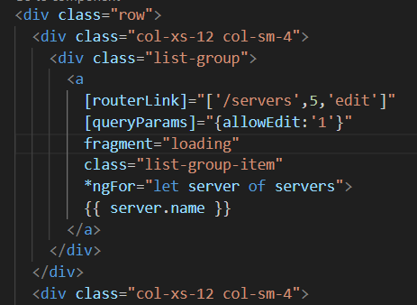
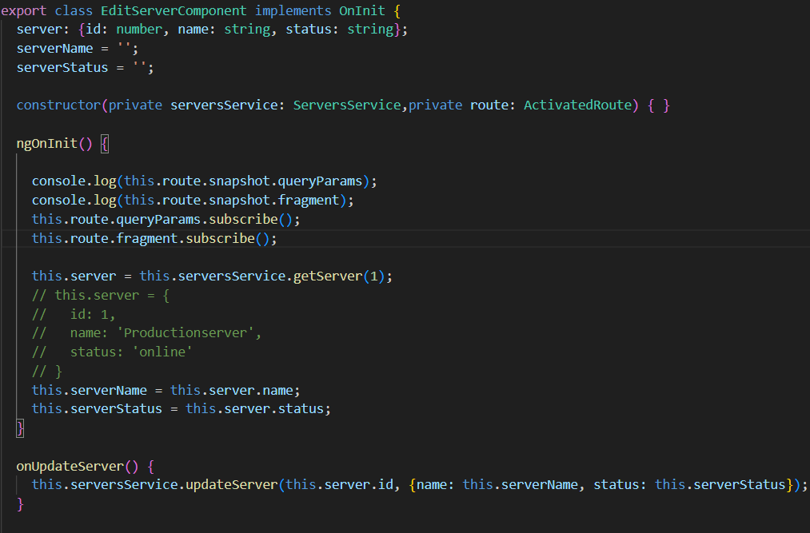
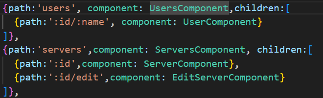

# RoutingStart

This project was generated with [Angular CLI](https://github.com/angular/angular-cli) version 16.1.7.

## Development server

Run `ng serve` for a dev server. Navigate to `http://localhost:4200/`. The application will automatically reload if you change any of the source files.

## Code scaffolding

Run `ng generate component component-name` to generate a new component. You can also use `ng generate directive|pipe|service|class|guard|interface|enum|module`.

## Build

Run `ng build` to build the project. The build artifacts will be stored in the `dist/` directory.

## Running unit tests

Run `ng test` to execute the unit tests via [Karma](https://karma-runner.github.io).

## Running end-to-end tests

Run `ng e2e` to execute the end-to-end tests via a platform of your choice. To use this command, you need to first add a package that implements end-to-end testing capabilities.

## Further help

To get more help on the Angular CLI use `ng help` or go check out the [Angular CLI Overview and Command Reference](https://angular.io/cli) page.

## 02

Main Routes have been configured and Registered with RouterModule and we have specified the place to render currently selected path component using `<router-outlet>` directive.

## 03

- It would be nice to navigate from with in the app instead of typing in the url bar.
- For this we could have used href, but it's default behaviour is to send the request to the server. Because of this our page reloads and restarts, loosing our entire App state.
- Angular offers us a routerLink which will prevent default behaviour and renders the component without reloading.

## 04

- `<a routerLink="servers">Reload Page</a>`
  `<a routerLink="./servers">Reload Page</a>`
  `<a routerLink="../users">Reload Page</a>`
  These are relative Paths`

- `<a routerLink="/servers">Reload Page</a>`
  This is an Absolute Path

## 05

- class active will defaultly make that link as active.
- For this, router module provides routerLinkActive which holds active class which indicates make the currently clicked link as active `routerLinkActive="active"`
- By default this will mark the links as active. i.e. it checks what are all links lead to the currently loaded route.
- Therefore localhost:4200/servers/ here the loaded route has both empty and servers.
- To prevent this we use `[routerLinkActiveOptions]="{exact: true}"`.

## 06

- Lets say if we want to navigate to some component which is not on currently loaded app after a certain complex operation through programatically. We could use ` this.router.navigate(['/servers'])`. Eg. Route to /servers after button click.

* Unlike the routerLink, the navigate does not know on which route you are currently on.
* You could also use relative path here, but we need to specify the path from which this route needs to be navigated to.
* ActivatedRoute will give the currently loaded or Active route.
* `this.router.navigate(['servers'],{relativeTo:this.route})`

## 07

- We can add Parameter routes and dynamic segments in our paths.
- Later we will be able to retrieve that parameter inside of the loaded component by that name.
- The ActivatedRoute we injected will give access to the id passed in the url(here).

* this.user={
  id:this.route.snapshot.params['id'],
  name:this.route.snapshot.params['name']
  }

## 08

- If we want to navigate to the UserComponent from the UserComponent with different parameter values, the url gets changed, but we are already on the component which should get loaded. So Angular cleverly doesn't reinstantiate this component.
- That only costs us performance. Why would it re-render the component we already are on ?

* It won't recreate the whole component and destroy the old one if we already on that component. But If you still want updated data,we can use Observables.
* This works heavily with Asynchronous tasks, here the route params might change at some point in the future, if the user clicks this link, you don't know when and how long it will take. So, therefore, you can't block this code and wait for this to happen here.
* So, Observable is an easy way to subscribe to some event which might happen in the future, then execute some code when it happens without having to wait for it now. And that is what params is.

  

  **\* \*** When you go to another component and come again to the same component, Angular will destroy and re-create the component. But, It won't destroy any subscriptions, and therefore, it will stack into the memory. So, it is recommended to unsubscribe to it, whenever the component destroys using ngOnDestroy() method.

## 09 - Passing Query Parameters and fragments in the url through url/link click/Programmatic Navigation and Retrieving them from the Loaded Component.

- 

- 

- 

## 10 - Child Routes is Implemented for servers and users

- 

## 11 - Configuring the Handling of Query Parameters i.e while navigating from the current component to sub level component, we can pass query params of the current component to the next component using `queryParamsHandling`.

- Inside ServersComponent we have created a button in serverComponent, to navigate to the edit Component
- Here we have seen, The query params that were present on server click, does not appear when we click Edit button on the ServerComponent to navigate to EditComponent. i.e query params are not passing down to the next request.

* we can do that by using `this.router.navigate(['edit'],{relativeTo:this.route,queryParamsHandling:'preserve'});`

## 12 - For all invalid paths we have added redirect to PageNotFound Component

- `{path:'not-found',component: PageNotFoundComponent}`
  `{path:'**', redirectTo:'not-found'}`
